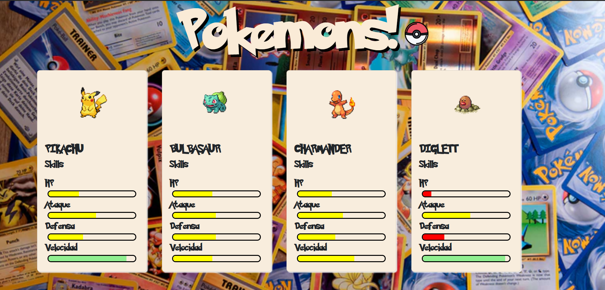

# Pokemons! 

Esta atividade consiste em usar barras de progresso para indicar as diferentes habilidades de cada pokemon. Para fazer isso, a partir de uma lista de pokemons, você deve manipular cada uma das cartas criadas para mostrar a imagem do pokemon e, além disso, poder preencher cada uma das barras de habilidades com a quantidade que corresponde a cada habilidade.

Além disso, dependendo do % de cada habilidade, a barra deve ser vermelha, amarela ou verde.

Depois que a atividade estiver concluída, você deverá ver o seguinte resultado final:

Pegue-os agora!  
